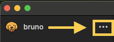
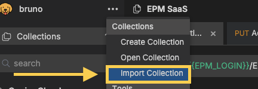
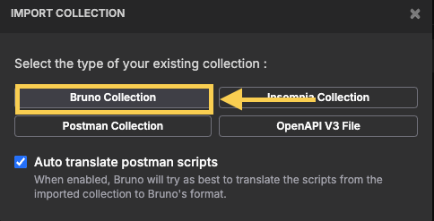
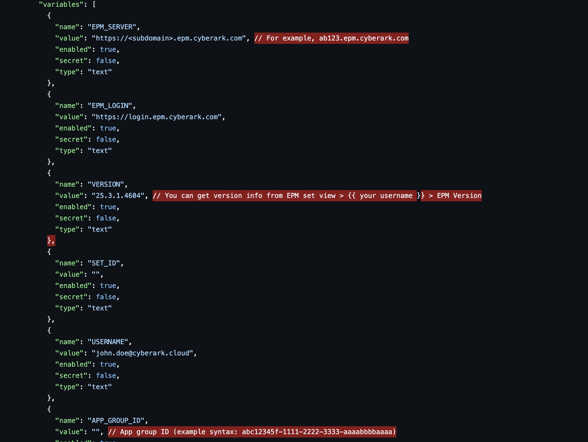

# EPM SaaS Bruno Collection

## Installing Bruno

If you don't already have Bruno installed and have homebrew installed, use the following command:

```Bash
brew install --cask bruno
```

If you'd prefer to bring in the binaries via web browser, you can download it from Bruno's homepage [here](https://www.usebruno.com/downloads).

## Instructions for usage

*NOTE*: Make sure you have git installed OR [Download the Zip](https://github.com/ztwright/cybr-epm-bruno-collection/archive/refs/heads/master.zip); Skip step 1 in [Importing collection to Bruno](#importing-collection-to-bruno) instead.

### Importing collection to Bruno

1. Open interactive terminal and make a directory or change to your github repositories location.

```shell
cd your/home/dir/
mkdir github
cd github/
git clone https://github.com/ztwright/cybr-epm-bruno-collection.git
```
2. Launch Bruno or equivalent API client

3. Click on the elipsis in the top-left portion of the screen.



4. Click **Import Collection**.



5. Select Bruno Collection type and the 'EPM SaaS.json' file.



6. Select a location in your user namespace (i.e., ``path/to/REST/CyberArk/EPM``) by choosing **Browse**.

7. Once finalized, select **Import**.

### Creating a new Environment Variable configuration

1.  Create a new environment; Click anywhere in the collection -> Collection Environments in the top-right of the window.

2.  Select **Configure**.

3. Add variables for the following:
   1. EPM_SERVER
   2. EPM_LOGIN
   3. VERSION
   4. SET_ID
   5. USERNAME
   6. PASSWORD
   7. TOKEN
   8. APP_GROUP_ID



## Usage Notes 

1. You will not have a token at first.  You will get the token in the response data from the initial ``POST Authenticate/`` request.  Copy that into the value of the environment variable that you created.
2. ``USERNAME`` and ``PASSWORD`` can be passed in as they would normally be entered signing in through the native login (``user@domain/password``).
3. Run 'Get sets' first to get a list of the user-defined sets that you are assigned to.
4. ``EPM_SERVER`` is the your CyberArk EPM tenant id, whereas ``EPM_LOGIN`` is the login URL for your tenant.
   - Be sure to replace ``<subdomain>`` placeholder in the environment variable (CyberArk -> **Configure**).